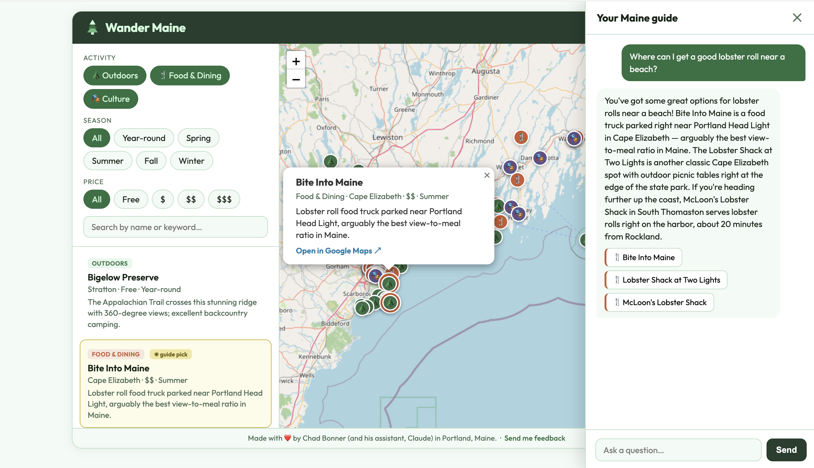

# Wander Maine

An interactive travel guide to Maine, built as a single-page web app. 164 hand-curated locations across four regions — Portland & Southern Maine, Midcoast, Western Mountains & Foothills, and Katahdin & Penobscot Headwaters — displayed on an interactive map with filters and an AI-powered chat guide.



---

## Features

- **Interactive map** — Leaflet.js + OpenStreetMap, color-coded pins by category (Outdoors, Food & Dining, Culture)
- **Filters** — filter by activity, season (including year-round logic), and price tier
- **Full-text search** — search by name or keyword across all 164 locations
- **AI chat guide** — ask natural-language questions ("where should I take kids on a rainy day?") and get recommendations with map highlights, powered by Claude via a secure Supabase Edge Function proxy
- **Location pills** — chatbot responses include clickable inline location pills that pan and highlight the map
- **Responsive design** — collapsible filter panel on mobile, full sidebar on desktop
- **Made with ❤️ in Portland, Maine**

---

## Tech Stack

| Layer | Technology |
|---|---|
| Frontend | Vanilla HTML/CSS/JS, single file |
| Map | [Leaflet.js](https://leafletjs.com/) + [OpenStreetMap](https://www.openstreetmap.org/) |
| Database | [Supabase](https://supabase.com/) (Postgres + PostgREST) |
| AI | [Anthropic Claude](https://www.anthropic.com/) (`claude-sonnet-4-6`) via Supabase Edge Function |
| Font | [Outfit](https://fonts.google.com/specimen/Outfit) (Google Fonts) |

---

## Project Structure

```
wander-maine/
├── app/
│   └── wander-maine.html          # The entire frontend — one file
├── supabase/
│   ├── migrations/
│   │   └── 001_create_locations_table.sql   # Database schema
│   └── functions/
│       └── chat-proxy/
│           └── index.ts           # Edge Function: secure Anthropic API proxy
└── data/
    ├── build_portland_southern.py # Data build scripts — one per region
    ├── build_midcoast.py
    ├── build_western_mountains.py
    └── build_katahdin.py
```

---

## Running Your Own Instance

### 1. Set up Supabase

1. Create a new project at [supabase.com](https://supabase.com)
2. Run the migration in `supabase/migrations/001_create_locations_table.sql` via the SQL editor
3. Populate the `locations` table using the Python scripts in `data/` (requires `pandas` and `openpyxl`)
4. Deploy the Edge Function: `supabase functions deploy chat-proxy --project-ref YOUR_PROJECT_REF`
5. Set your Anthropic API key as a secret on the Edge Function:  
   Dashboard → Edge Functions → chat-proxy → Secrets → Add `ANTHROPIC_API_KEY`

### 2. Configure the frontend

Open `app/wander-maine.html` and update the two constants near the top of the `<script>` block:

```javascript
const SUPABASE_URL = "https://YOUR_PROJECT_REF.supabase.co";
const SUPABASE_KEY = "YOUR_ANON_KEY"; // publishable/anon key — safe for client-side use
```

Both values are available in your Supabase project under Settings → API.

### 3. Open in a browser

The app is a single static HTML file — no build step, no server required. Open it directly in any modern browser.

---

## Data

All 164 locations are hand-curated personal recommendations across four Maine regions. The data build scripts (`data/`) generate Excel review spreadsheets for human QA before insertion into Supabase. Geocoordinates were sourced via Google Places.

---

## A Note on the Supabase Anon Key

The anon key in `wander-maine.html` is a **publishable key** — it's specifically designed to be safe in client-side code. It grants read-only access to the `locations` table (enforced by Row Level Security) and nothing else. Your Anthropic API key never appears in the frontend; it lives securely as a Supabase Edge Function secret.

---

## License

MIT — feel free to fork and build your own regional guide.

---

*Made with ❤️ by [Chad Bonner](https://github.com/chadbonner) (and his assistant, Claude) in Portland, Maine.*
